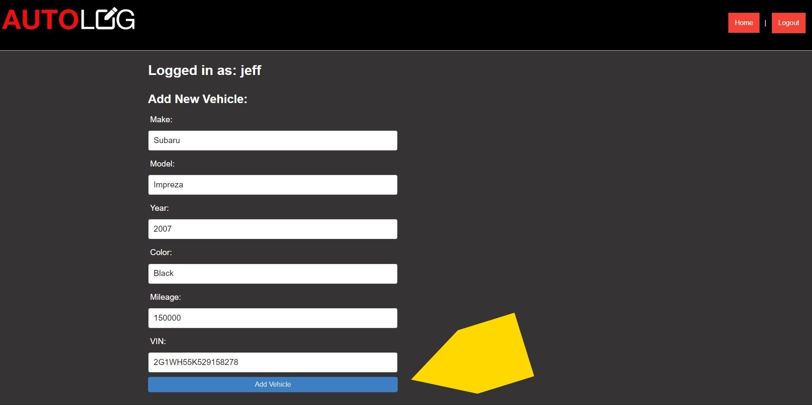

# AutoLog

[Link to deployed page](https://auto-log.herokuapp.com/)

Version 2.1

Deployment Date: 2/17/2023

### Contributors:
* **Nick McCarthy** - [GitHub](https://github.com/Nick-McCarthy)
* **Wiley Vincent** - [GitHub](https://github.com/WileyVincent)
* **Khevin Brahmbhatt** - [GitHub](https://github.com/khevb27)

## Purpose

AutoLog is a website that allows the user to track their vehicle maintenance history. Users may store a list of their vehicles and attach them to their account. By entering service records such as oil changes, a service history is stored including the date of the maintenance and mileage at the time. This tool is a simple way to get a leg up with insurance and resell value.

## Features 

- User login to store information
- User vehicle tracker
- Vehicle service records/history displayed in log form

## Getting Started

1. Navigate to [AutoLog](https://auto-log.herokuapp.com/) in a browser.

2. Click "login" in the top right to either login or signup.

  

3. After logging in, you will be greeted with a form to enter vehicle info. You can use the form to save details about specific vehicles to your account. Enter desired info and click "Add Vehicle" to save to your account.

  

4. If you have any saved vehicles they will show up on the left. Click on the vehicle you would like to inspect.

  

5. After clicking on a vehicle, you will be taken to the details page for that vehicle. At the bottom of this page is a form where you can add entries for service/maintenance history.

  

6. Click "Home" in the top right to return to your vehicle dashboard at any time (while logged in).

## Built Using
**[JavaScript](https://www.javascript.com/)**

**[MYSQL](https://www.mysql.com/)**

**[sequelize](https://sequelize.org/)**

**[handlebars](https://handlebarsjs.com/)**

**[bcrypt](https://www.npmjs.com/package/bcrypt)**

## Development

Figma was used for the [wireframe](https://drive.google.com/file/d/1QDXKDZciil1BbEgsD9Bzzi-zeKnFGvpQ/view?usp=sharing).
